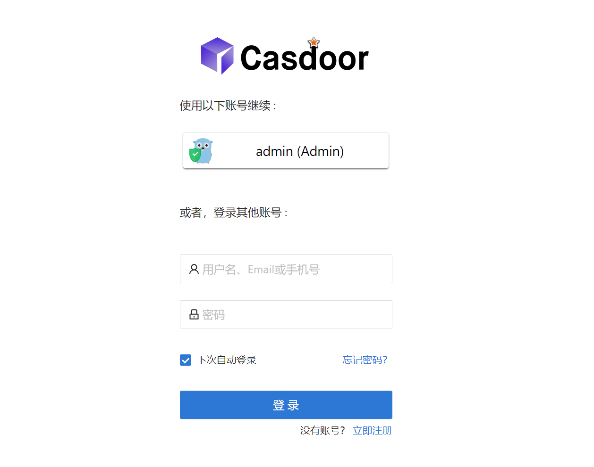

# Casdoor Spring Cloud Gateway Example

[](https://github.com/casdoor/casdoor-springcloud-gateway-example/actions/workflows/build.yml)
[](https://github.com/casdoor/casdoor-springcloud-gateway-example/blob/master/LICENSE)
[](https://discord.gg/5rPsrAzK7S)

An example of signing users in with [Casdoor](https://casdoor.ai/) at a Spring Cloud Gateway, and protecting the services behind it with Casdoor access tokens. Both use [casdoor-spring-boot-starter](https://github.com/casdoor/casdoor-spring-boot-starter).

| Module                               | Role                                                                  | Port |
|--------------------------------------|-----------------------------------------------------------------------|------|
| [casdoor-gateway](casdoor-gateway)   | Spring Cloud Gateway (WebFlux): signs users in, routes `/api/**`      | 9090 |
| [casdoor-api](casdoor-api)           | A business service (Spring MVC): accepts only Casdoor access tokens   | 9091 |

## How it works

```
browser ──session──▶ casdoor-gateway ──Authorization: Bearer <access token>──▶ casdoor-api
                          │                                                        │
                          └──── OAuth2 login ────▶ Casdoor ◀──── JWKS ─────────────┘
```

1. casdoor-spring-boot-starter reads the `casdoor.*` properties and configures Spring Security for Casdoor: an OAuth2 client registration `casdoor` in the gateway, a JWT resource server (JWKS URL and audience) in the API.
2. The gateway turns on `oauth2Login()` ([SecurityConfig](casdoor-gateway/src/main/java/org/casbin/casdoor/gateway/example/config/SecurityConfig.java)). **Login with Casdoor** goes to `/oauth2/authorization/casdoor` and then the Casdoor sign-in page; Casdoor redirects back to `http://localhost:9090/login/oauth2/code/casdoor`, where Spring Security checks the state and gets the tokens.
3. `/api/**` needs a signed-in user (401 otherwise) and is routed to casdoor-api with the `TokenRelay` filter, which adds the user's access token as `Authorization: Bearer ...`.
4. casdoor-api verifies the token with Casdoor's JWKS ([SecurityConfig](casdoor-api/src/main/java/org/casbin/casdoor/api/example/config/SecurityConfig.java)) and reads the user from its claims, so calling it directly without a token gets 401.
5. **Logout** ends the gateway session and the Casdoor session (`AuthService.logoutCurrentSession()`).

## Prerequisites

- Java 17+ and Maven 3.9+ (or `./mvnw`)
- A Casdoor server. The example is preconfigured for the public demo server https://door.casdoor.com, so it runs as is. To use your own, see [Casdoor installation](https://casdoor.ai/docs/basic/server-installation).

## Configuration

Skip this section to try the example with the public demo server.

In your Casdoor, create (or reuse) an organization and an application, and add `http://localhost:9090/login/oauth2/code/casdoor` to the application's **Redirect URLs**. Then fill in the same application in both [casdoor-gateway/src/main/resources/application.yml](casdoor-gateway/src/main/resources/application.yml) and [casdoor-api/src/main/resources/application.yml](casdoor-api/src/main/resources/application.yml):

```yaml
casdoor:
  endpoint: https://door.casdoor.com          # Casdoor server URL
  client-id: 294b09fbc17f95daf2fe             # client ID of the application
  client-secret: dd8982f7046ccba1bbd7851d5c1ece4e52bf039d  # client secret of the application
  organization-name: casbin                   # organization of the application
  application-name: app-vue-python-example    # name of the application
```

The gateway's route to the API:

```yaml
spring:
  cloud:
    gateway:
      server:
        webflux:
          routes:
            - id: api-route
              uri: http://localhost:9091
              predicates:
                - Path=/api/**
              filters:
                - TokenRelay=
```

## Run

```shell
git clone https://github.com/casdoor/casdoor-springcloud-gateway-example
cd casdoor-springcloud-gateway-example
mvn package
```

In two terminals:

```shell
java -jar casdoor-api/target/casdoor-api-0.0.1-SNAPSHOT.jar
```

```shell
java -jar casdoor-gateway/target/casdoor-gateway-0.0.1-SNAPSHOT.jar
```

Open http://localhost:9090. **Get Resource** answers 401 until you click **Login with Casdoor**. On the demo server, sign in with username `admin` and password `123`:



After signing in, the buttons call casdoor-api through the gateway, and the API answers with the user from the access token.

## Resources

- [Casdoor documentation](https://casdoor.ai/docs/overview)
- [Casdoor Spring Cloud Gateway integration](https://casdoor.ai/docs/integration/java/spring-cloud-gateway/)
- [casdoor-spring-boot-starter](https://github.com/casdoor/casdoor-spring-boot-starter)
- [Spring Cloud Gateway TokenRelay](https://docs.spring.io/spring-cloud-gateway/reference/spring-cloud-gateway-server-webflux/gatewayfilter-factories/tokenrelay-factory.html)

## License

[Apache-2.0](LICENSE)
